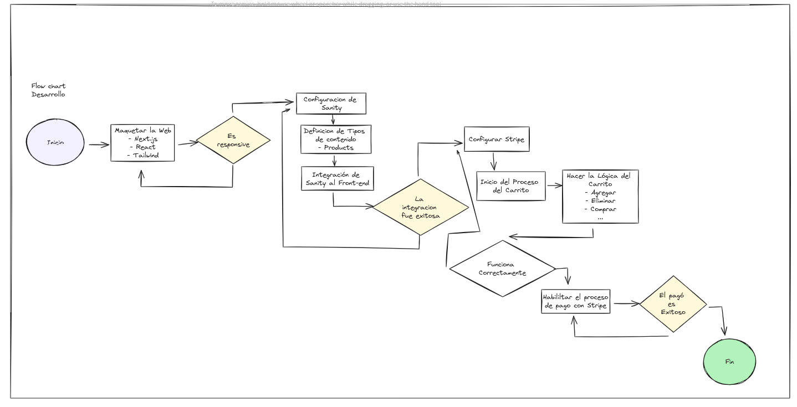
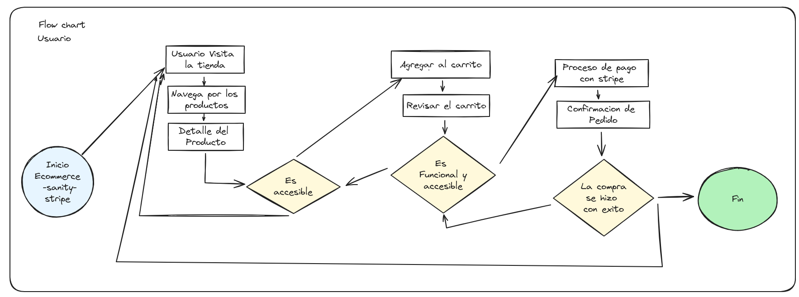

# ECOMMERCE-SANITY-STRIPE

[View](https://ecommerce-sanity-project-phi.vercel.app/)

## Descripción

Este proyecto consiste en desarrollar un sistema de comercio electrónico (e-commerce) utilizando las tecnologías Sanity y Stripe. La plataforma permitirá a los usuarios explorar productos, agregar artículos a su carrito de compras y completar el proceso de pago a través de la integración con Stripe.

## Desarrollo





## Tecnologías

- React
- Sanity
- Stripe
- Next.js
- Tailwind

## Objetivo

- Mejorar mis habilidades de programación.
- Aprender nuevas tecnologías.

## Instalación

```bash
git clone https://github.com/ecommerce-sanity-project.git

cd ecommerce-sanity-project

pnpm install

pnpm dev

```
